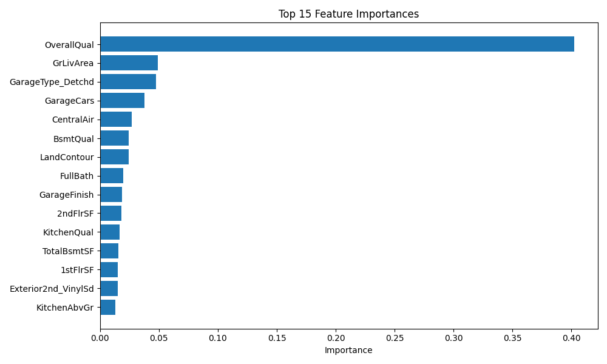

# House Price Prediction Project


## Project Overview

This project implements a machine learning system to predict house prices based on various property features. It follows a modular code structure and includes a user-friendly [Streamlit web interface](https://pridicthouseprice.streamlit.app/)  that allows users to input property details and receive price predictions. The data used in this project is from a Kaggle competition house-prices-advanced-regression-techniques.

[Check the app here](https://pridicthouseprice.streamlit.app/) 

Key features include:
- Data preprocessing with feature engineering
- Model comparison and selection
- Exploratory data analysis and visualizations
- Interactive web application with dark/light mode
- Feature importance visualization
- Modular and reusable codebase

## Data Science Pipeline

The project implements a complete data science pipeline:
1. **Data Ingestion**: Loading and splitting data
2. **Data Transformation**: Feature engineering, preprocessing, and scaling
3. **Model Training**: Training and comparing multiple regression models
4. **Model Evaluation**: Using R² score to evaluate and select the best model
5. **Feature Importance Analysis**: Identifying the most influential features
6. **Prediction Interface**: User-friendly web application

## Models Implemented

The pipeline compares multiple regression models:
- Linear Regression
- Ridge Regression
- Decision Tree
- Random Forest
- XGBoost
- LightGBM
- CatBoost
- Gradient Boosting
- AdaBoost
- K-Nearest Neighbors

## Screenshots

### Web Application UI


### Feature Importance


### Price Prediction


## Project Structure

```
housing_price_prediction/
├── artifacts/             # Trained models and artifacts
│   └── plots/             # Generated visualizations
├── data/
│   ├── processed/         # Train/test data after splitting
│   ├── preprocessed/      # Data after preprocessing
│   └── raw/               # Original dataset
├── logs/                  # Application logs
├── src/
│   ├── components/        # Core ML pipeline components
│   │   ├── data_ingestion.py
│   │   ├── data_transformation.py
│   │   ├── model_trainer.py
│   │   └── visualize_results.py
│   ├── pipeline/          # End-to-end pipelines
│   │   ├── predict_pipeline.py
│   │   └── train_pipeline.py
│   ├── exception.py       # Custom exception handling
│   ├── logger.py          # Logging configuration
│   └── utils.py           # Utility functions
├── .gitignore
├── app.py                 # Streamlit web application
├── requirements.txt       # Project dependencies
└── README.md              # Project documentation
```

## Installation and Setup

### Prerequisites
- Python 3.7+
- pip or conda package manager

### Option 1: Using pip and venv

```bash
# Clone the repository
git clone https://github.com/yourusername/housing_price_prediction.git
cd housing_price_prediction

# Create a virtual environment
python -m venv venv

# Activate the virtual environment
# On Windows
venv\Scripts\activate
# On macOS/Linux
source venv/bin/activate

# Install dependencies
pip install -r requirements.txt
```

### Option 2: Using Conda

```bash
# Clone the repository
git clone https://github.com/codeandcharts/housing_price_prediction.git
cd housing_price_prediction

# Create a conda environment
conda create -n house_price_env python=3.9

# Activate the environment
conda activate house_price_env

# Install dependencies
pip install -r requirements.txt
```

## Running the Project

### Training the Model

```bash
# Run the training pipeline
python src/pipeline/train_pipeline.py
```

### Starting the Web Application

```bash
# Launch the Streamlit interface
streamlit run app.py
```

The app will be available at http://localhost:8501 in your web browser.

## Technical Implementation

### Feature Engineering

The model utilizes several feature engineering techniques:
- Handling missing values with appropriate imputation strategies
- Ordinal encoding for categorical features with inherent order
- One-hot encoding for nominal categorical features
- Feature scaling to normalize numerical values

### Model Selection

Models are evaluated using R² score on a validation set. Hyperparameter tuning is performed using GridSearchCV to optimize each model's performance.

### Feature Importance

Feature importance analysis reveals that these factors most strongly influence house prices:
1. Overall Quality
2. Living Area Size
3. Garage Capacity
4. Basement Size
5. Full Bathrooms
6. Year Built

### Future Improvements

1. Use real-data from Zillow or realtor
2. Add location, city and country information
3. Add real-time data
4. Add advanced visualizations for model performance analysis
5. Implement additional feature engineering techniques
6. Create presets for different housing types
7. Add geographical visualization for neighborhood comparisons
8. Implement model explainability for individual predictions


[App](https://pridicthouseprice.streamlit.app/) 

## 📄 License

This project is licensed under the MIT License - see the LICENSE file for details.

## 🙏 Acknowledgments

- Dataset source: [Kaggle Housing Prices Competition](https://www.kaggle.com/c/house-prices-advanced-regression-techniques)
- Inspired by various regression analysis techniques in the field of real estate valuation
